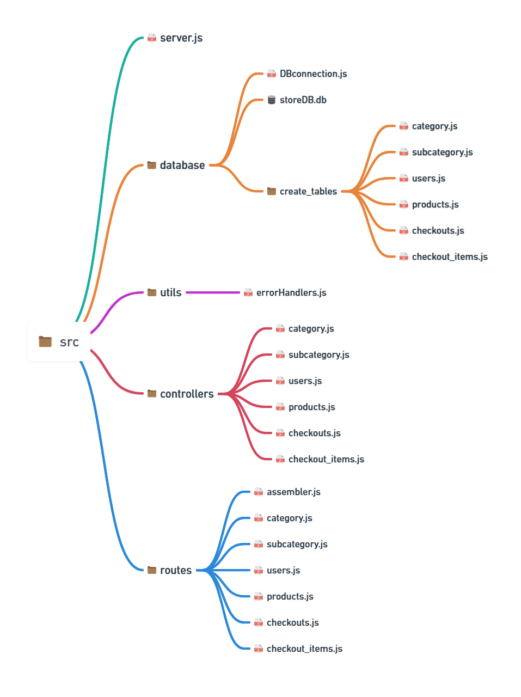

<h1>1. Preparar ambiente</h1>

Criar o arquivo de configurações do projeto e instalar módulos:

```bash
npm init -y                                 # configuracao do projeto

npm install sqlite sqlite3                  # DBs
npm install express express-async-errors    # server
npm install dotenv bcryptjs                 # var de ambientes e hash
npm install nodemon --save-dev              # reinicio auto do server (dependencia local)
```

Iniciar o git (`git init`) e inserir a pasta `node_modules` no `.gitignore`.

Dentro do arquivo `package.json`, setar o "start" do npm do projeto para com o nodemon apontando para o arquivo que irá iniciar o 
servidor (algo como `server.js`). A configuração do projeto no packages estará completa. No terminal, 
ao rodar `npm start` o servidor poderá ser iniciado localmente e será reiniciado sempre que algum arquivo sofrer alteração.
Útil para o momento do desenvolvimento.

```json
{
  "name": "proj",
  "version": "1.0.0",
  "main": "index.js",
  "scripts": {
    "start":"nodemon src/server.js"
  },
  "keywords": [],
  "author": "",
  "license": "ISC",
  "description": "",
  "dependencies": {
    "bcryptjs": "^2.4.3",
    "dotenv": "^16.4.5",
    "express": "^4.19.2",
    "express-async-errors": "^3.1.1",
    "sqlite": "^5.1.1",
    "sqlite3": "^5.1.7"
  },
  "devDependencies": {
    "nodemon": "^3.1.4"
  }
}
```

O simples arquivo server.js abaixo já é suficiente para testar:

```js
const express = require('express')

const port = 3000

const app = express().use(express.json())

app.get('/', (req, res) => {
    res.send(`Welcome to store API!
              More routes on the way!`)
})

app.listen(port, () => {
    const mainResponse = `Server on listening to port ${port}`
    console.log(mainResponse)
})

// no terminal ->> npm start
```


<h1>2. O projeto</h1>

Aplicação de uma loja. Com cadastros de produtos, suas categorias e subcategorias, usuários, checkouts e estoque:


A estrutura dos arquivos:



<b>Do conteúdo de `src`:</b>

1. `server.js`: Arquivo principal, inicia o servidor e tudo desemboca aqui.
2. `database`: Pasta com o arquivo do database, JS de criação de cada tabela e script de conexão com banco mysqlite.
3. `controllers`: Pasta contendo o script de CRUD de cada tabela. Cada CRUD é um método de uma classe.
4. `routes`: Pasta contendo o script de cada rota para cada comando CRUD de cada tabela. Além de um arquivo que consolida todas as rotas em uma única rota, que é exportada e enviada para o arquivo do servidor.
5. `utils`: Contém o arquivo com a classe de erro personalizada para tratamento de erros.
